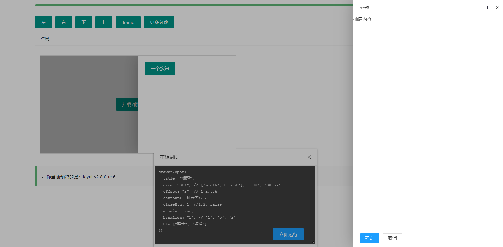

# layer-drawer

### layer-drawer 是一个基于 layer 扩展的抽屉模块



# 快速开始

```js
// 将 `drawer` 文件夹复制到你的模块目录
layui.config({
      base: './' //假设这是你存放拓展模块的根目录
    }).extend({ //设定模块别名
      drawer: 'drawer/drawer'
});

layui.use(['drawer'],function() {
  var drawer=layui.drawer;

  $('#drawerLeft').click(function() {
    drawer.open({
      title: ["标题",'font-size:16px;color:#2d8cf0'],
      offset: "l",
      closeBtn: 1,
      content: '抽屉内容'
    })
  })
})

```

# 参数
```ts
type Index = number;
type Selector = string;
/**
 * 基础参数
 */
interface Options {
  /**
   * 指定抽屉挂载节点
   * @default 'body'
   * @description 指定容器内打开，需使用 layer 捕获层模式，并设置目标容器 `style="overflow: hidden; position: relative;"`
   */
  target?: Selector | undefined;
  /**
   * 标题
   * @default false
   * @example
   * '我是标题'
   * ['文本', 'font-size:18px;']
   * false    //不显示标题栏
   */
  title?: string | false | [string, string] | undefined;
  /**
   * 设置iframe类型的弹层
   * @example
   * "http://xxx.xx"
   */
  iframe?: string | undefined;
  /**
   * 设置url类型的弹层,html片段会拼接在当前页面中,片段和当前页不能有相同的id
   */
  url?: Jquery | undefined;
  /**
   * 内容
   * @default ''
   */
  content?: string | HTMLElement | JQuery | [string, string] | undefined;
  /**
   * 抽屉宽或高
   * @default '30%'
   * @example
   * '500px'    //定义宽或高，根据打开方向自适应
   * ['500px', '300px']    //定义宽高
   */
  area?: string | [string, string] | undefined;
  /**
   * 抽屉打开方向 l = 左, r = 右, t = 上, b = 下
   * @default 'r'
   * @example
   * 'r'
   */
  offset?: string | [string, string] | undefined;
  /**
   * 按钮
   * @default '确认'
   * @description btn默认是一个确认按钮
   */
  btn?: string | string[] | undefined;
  /**
   * 按钮排列
   * @default 'r'
   * @example
   * 'l'    //按钮左对齐
   * 'c'    //按钮居中对齐
   * 'r'    //按钮右对齐。默认值，不用设置
   */
  btnAlign?: 'l' | 'c' | 'r' | undefined;
  /**
   * 关闭按钮
   * @description layer提供了两种风格的关闭按钮，可通过配置1和2来展示，如果不显示，则closeBtn: 0 或 false
   * @default false
   */
  closeBtn?: 0 | 1 | 2 | boolean | undefined;
  /**
   * 遮罩
   * @default 0.3
   * @example [0.8, '#393D49']    //透明度、颜色
   */
  shade?: number | false | [number, string] | undefined;
  /**
   * 是否点击遮罩关闭
   * @description 如果你的shade是存在的，那么你可以设定shadeClose来控制点击抽屉外区域关闭。
   * @default false
   */
  shadeClose?: boolean | undefined;
  /**
   * 自动关闭所需毫秒
   * @default 0 //不会自动关闭
   */
  time?: number | undefined;
  /**
   * 用于控制弹层唯一标识
   * @description 设置该值后，不管是什么类型的层，都只允许同时弹出一个。一般用于页面层和iframe层模式
   * @default ''
   */
  id?: string | undefined;
  /**
   * 关闭动画
   * @default true
   */
  isOutAnim?: boolean | undefined;
  /**
   * 最大最小化
   * @default false
   * @description 显示最大小化按钮。该参数值对type:1和type:2有效。
   */
  maxmin?: boolean | undefined;
  /**
   * 是否允许拉伸
   * @default false
   * @description 可以在弹层右下角拖动来拉伸尺寸。
   */
  resize?: boolean | undefined;
  /**
   * 监听窗口拉伸动作
   * @param layero 当前层的DOM对象
   */
  resizing?(layero: JQuery): void;
  /**
   * 是否允许浏览器出现滚动条
   * @default true
   */
  scrollbar?: boolean | undefined;
  /**
   * 层叠顺序
   * @default 19891014
   * @description 一般用于解决和其它组件的层叠冲突。
   */
  zIndex?: number | undefined;
  /**
   * 是否默认堆叠在左下角
   * @default true
   */
  minStack?: boolean | undefined;
  /**
   * 层弹出后的成功回调方法
   * @param layero 当前层DOM
   * @param index 当前层索引
   */
  success?(layero: JQuery, index: Index): void;
  /**
   * 确定按钮回调方法
   * @param index 当前层索引
   * @param layero 当前层DOM对象
   * @description 如果设定了yes回调，需进行手工关闭，`close(index)`。
   * 按钮1的回调是yes，而从按钮2开始，则回调为btn2: function(){}，以此类推。
   */
  yes?(index: Index, layero: JQuery): void;
  //#region 按钮1的回调是yes，而从按钮2开始，则回调为btn2: function(){}，以此类推。
  btn2?(index: Index, layero: JQuery): false | void;
  btn3?(index: Index, layero: JQuery): false | void;
  btn4?(index: Index, layero: JQuery): false | void;
  btn5?(index: Index, layero: JQuery): false | void;
  btn6?(index: Index, layero: JQuery): false | void;
  btn7?(index: Index, layero: JQuery): false | void;
  btn8?(index: Index, layero: JQuery): false | void;
  btn9?(index: Index, layero: JQuery): false | void;
  //#endregion
  /**
   * 右上角关闭按钮触发的回调
   * @param index 当前层索引
   * @param layero 当前层的DOM对象
   * @description 默认会自动触发关闭。如果不想关闭，`return false`
   */
  cancel?(index: Index, layero: JQuery): false | void;
  /**
   * 层销毁后触发的回调
   * @description 无论是确认还是取消，只要层被销毁了，end都会执行，不携带任何参数。
   */
  end?(): void;
  /**
   * 最大化后触发的回调
   * @param layero 当前层DOM
   */
  full?(layero: JQuery): void;
  /**
   * 最小化后触发的回调
   * @param layero 当前层DOM
   * @description `return false` 不执行默认最小化。
   */
  min?(layero: JQuery): false | void;
  /**
   * 还原后触发的回调
   * @param layero 当前层DOM
   */
  restore?(layero: JQuery): void;
}

/**
 * 抽屉模块
 */
interface Drawer {
  /**
   * 打开一个抽屉
   * @param options
   * @description 返回index为层的索引
   */
  open(options?: Options): Index;
  /**
   * 关闭指定的抽屉
   * @param index
   */
  close(index: Index): void;
  /**
   * 关闭所有层
   */
  closeAll(): void;
  /**
   * 重新定义抽屉的样式
   * @param index
   * @param cssStyle
   * @description 参数index为层的索引，cssStyle允许你传入任意的css属性
   */
  style(index: Index, cssStyle: Partial<CSSStyleDeclaration>): void;
  /**
   * 改变抽屉的标题
   * @param title 要改变的值
   * @param index 抽屉索引
   */
  title(title: string, index: Index): void;
}
```
